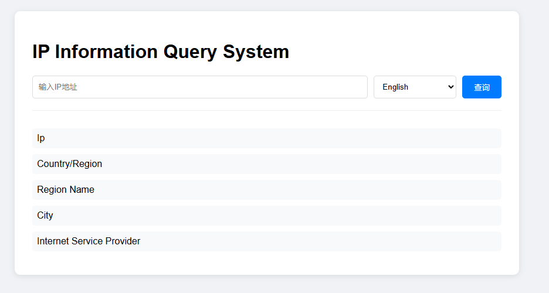

[中文](../README.zh-CN.md) [English](README.en.md) [日本語](README.ja.md) [Русский](README.ru.md) [Deutsch](README.de.md) [Français](README.fr.md)

# Ferramenta de Consulta de Informações IP



## test website

[https://ip.fantacy.online/](https://ip.fantacy.online/)

## Funcionalidades Principais
- Geolocalização de IP em tempo real
- Detecção de país/região/cidade/provedor
- Suporte multilíngue (Português/Inglês/Chinês/Japonês/Russo/Alemão/Francês)
- API RESTful simples

## Tecnologias
- Python 3.8+
- Framework Web Flask
- Fonte de dados ip-api.com

## Instalação
1. Instalar dependências
```bash
pip install -r requirements.txt
```

2. Iniciar servidor
```bash
python server.py
```

3. Acessar http://localhost:5000 no navegador

## Documentação da API
```
GET /api/ip-info?ip=[IP-alvo]&lang=[código-idioma]
```

## Idiomas Suportados
| Arquivo de idioma | Idioma |
|---------|---------|
| pt-BR | Português |
| en | Inglês |
| zh-CN | Chinês simplificado |
| ja | Japonês |
| ru | Russo |
| de | Alemão |
| fr | Francês |